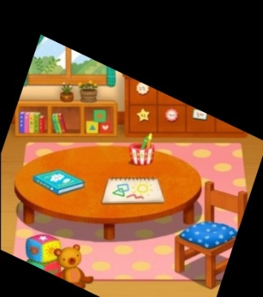

# 다른 그림 찾기

*작성일 : 2018-06-08*

## FLOW

1. 두 영상을 읽는다. 각 영상을 a, b라 한다.
2. b를 a의 위상으로 변환하여 두 영상의 위상을 일치시킨다.
3. 영상을 gray scale로 변환하고 각 영상의 최소, 최댓값으로 계조를 정규화한다.
4. 두 영상의 차이에 절댓값을 취한 뒤, 이진화한다.
5. contour를 찾고, 각 contour의 bounding rectangle를 구한다.
6. 특정 거리보다 가까운 사각형들을 클러스터링한다.

## DETAIL-1

```python
def harmonize_topologies(query, train) -> M, query_out, train_out
```

### SUMMARY

두 개의 이미지를 비교하기에 앞서 한 이미지가 변형되었거나, 한 이미지의 일부분일 가능성이 있다. 이 때는 이미지들을 서로 비교하기 힘들기 때문에 두 개의 이미지를 같은 형태로 만들어주는 작업이 필요하다.
`harmonize_topologies` 함수는 매개변수로 Query 이미지와 Train 이미지를 받는다. 이 함수는 Train 이미지와 Query 이미지를 같은 형태로 변환하고 변환에 사용된 Homography Matrix를 반환한다. 함수의 주요 내용은 다음과 같다.
1. 입력 받은 Query 이미지를 Train 이미지 형태와 같게 만든다.
2. Query 이미지가 만약 Train 이미지의 일부분이라면 Train 이미지도 Query 이미지의 부분 외에는 제거한다.

데이터의 변환 Flow는 다음과 같다.
1. SIFT 알고리즘을 사용하여 두 이미지의 키 포인트와 디스크립터를 생성한다.
2. Matcher를 사용하여 두 이미지의 매칭된 키 포인트를 뽑아낸다.
3. 키 포인트를 기반으로 Homography Matrix를 생성한다.
4. Query 이미지를 Homography Matrix로 Warp하여 Train 이미지의 형태로 변환한다.
5. 변환된 Query 이미지의 Polygon을 Train에 Masking한다.
위 과정을 거치며 알고리즘은 scale-invariant, translation-invariant, rotation-invariant, transformation-invariant 특성을 가지게 된다.

### RESULT

<table>
  <tr>
    <td></td>
    <td></td>
    <td></td>
    <td></td>
  </tr>
  <tr>
    <td align="center"><i>Query Image</i></td>
    <td align="center"><i>Train Image</i></td>
    <td align="center"><i>Query Image Output</i></td>
    <td align="center"><i>Train Image Output</i></td>
  </tr>
</table>

## DETAIL-2

1. `harmonize_topologies`함수를 이용해 b의 위상을 a의 위상으로 변환한다.
2. 두 영상을 gray scale로 변환한다.
3. 각 영상의 최소, 최댓값으로 영상을 normalize한다. 여기서 계조 변화에 invariant한 특성을 갖게 된다.
4. 두 영상의 차이에 절댓값을 취한다. 
5. 노이즈를 억제하기 위해 Gaussian Blur를 적용한다. ksize = (13x13)
6. 영상을 이진화한다. 경계값은 경험적으로 0.15로 결정하였다.
7. 위상을 일치시키는 과정에서 얇은 경계선이 남는 경우가 있으므로 open연산으로 이를 제거한다.
8. contour와 contour의 bounding rectangle를 찾는다. 이때, contour의 넓이가 너무 작은 것은 노이즈일 가능성이 높으므로 200이상인 것만 선택한다.
9. 가까운 사각형들을 하나로 만들기 위해 클러스터링한다. 두 사각형 중심점 사이의 거리가 60 이하인 사각형들을 하나로 합친다.
10. b에서의 사각형 좌표를 구하기 위해 `harmonize_topologies`에서 사용한 homography matrix, M의 역행렬 M_inv을 구한다.
11. M_inv를 이용해 b의 위상으로 변환한 사각형 좌표들을 구한다.
12. 각각의 사각형들을 각 이미지에 그린다.

### RESULT

<table style="text-align: center">
  <tr>
    <td></td>
    <td>
      
    </td>
    <td>
      
    </td>
  </tr>
  <tr>
    <td align="center"><i>Unclustered Rectangles</i></td>
    <td colspan="2" align="center"><i>Clustered Rectangles</i></td>
  </tr>
</table>

<table style="text-align: center">
  <tr>
    <td></td>
  </tr>
  <tr>
    <td align="center"><i>Transformation Invariant Example</i></td>
  </tr>
</table>
